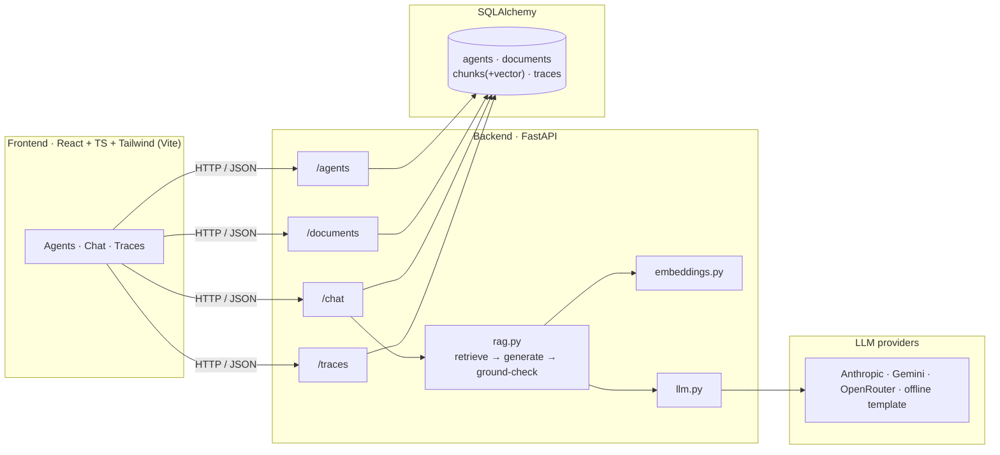

<div align="center">

# Muster

**A lightweight, self-hostable platform for building, running, and observing retrieval-grounded AI agents.**

Define an agent, give it a knowledge base, chat with it, and see every run traced — with a built-in guardrail that checks each answer is actually grounded in its sources.

[](https://www.python.org/)
[](https://fastapi.tiangolo.com/)
[](https://react.dev/)
[](https://www.typescriptlang.org/)
[](LICENSE)

</div>

---

## Table of Contents

- [Features](#features)
- [Architecture](#architecture)
- [Tech Stack](#tech-stack)
- [Getting Started](#getting-started)
- [Configuration](#configuration)
- [Usage](#usage)
- [API Reference](#api-reference)
- [How It Works](#how-it-works)
- [Project Structure](#project-structure)
- [Testing](#testing)
- [Roadmap](#roadmap)
- [License](#license)

---

## Features

- **Agent studio** — create and configure agents (name, system prompt, model) through a clean UI or REST API.
- **Knowledge base & RAG** — upload `.txt` / `.md` / `.pdf` files; they're chunked, embedded, and retrieved per question so answers are grounded in your data.
- **Grounding guardrail** — every answer is checked against its retrieved sources and labelled `grounded`, `ungrounded`, or `no_context` — a first line of defence against hallucination.
- **Cited answers** — responses reference the exact chunks they used, with similarity scores, so answers are traceable back to the source.
- **Observability** — one trace per run captures latency, token usage, provider/model, and the guardrail verdict.
- **Pluggable LLM providers** — Anthropic, Google Gemini, and OpenRouter behind one interface, plus a **deterministic offline fallback** so the whole app runs and demos with **no API key**.
- **Zero-config to production** — SQLite out of the box; point one env var at Postgres/Supabase when you're ready.

---

## Architecture



**Request flow (chat):** embed the question → cosine-rank the agent's chunks → inject the top-K into a system prompt that requires `[chunk N]` citations → generate with the active provider → verify the answer cites retrieved chunks (guardrail) → persist a trace → return the answer, citations, and metrics.

---

## Tech Stack

| Layer | Technology |
| --- | --- |
| **Frontend** | React 18, TypeScript, Tailwind CSS, Vite, React Router |
| **Backend** | FastAPI, Pydantic v2, SQLAlchemy 2 |
| **Storage** | SQLite (default) → PostgreSQL / Supabase via `DATABASE_URL` |
| **LLM providers** | Anthropic · Google Gemini · OpenRouter · offline template |
| **Embeddings** | Dependency-free hashing embedding (swappable for a hosted model / pgvector) |

---

## Getting Started

### Prerequisites

- **Python 3.12+**
- **Node.js 18+**
- No API key required — the app falls back to an offline provider.

### 1. Backend

```bash
cd backend
python -m venv .venv
source .venv/bin/activate          # Windows (Git Bash): source .venv/Scripts/activate
pip install -r requirements.txt
cp .env.example .env               # optional — add a provider key for real generation
uvicorn app.main:app --reload --port 8000
```

Interactive API docs: **http://localhost:8000/docs**

### 2. Frontend

```bash
cd frontend
npm install
npm run dev
```

Open **http://localhost:5173** (Vite proxies `/api` to the backend on port 8000).

---

## Configuration

All backend settings are read from environment variables or `backend/.env` (see [`.env.example`](backend/.env.example)).

### Provider selection

The active LLM provider is chosen by `LLM_PROVIDER`, or — if unset — auto-selected by whichever key is present, in this order:

```
Anthropic  →  Gemini  →  OpenRouter  →  offline template (no key needed)
```

### Environment variables

| Variable | Default | Description |
| --- | --- | --- |
| `LLM_PROVIDER` | _(auto)_ | Force a provider: `anthropic` \| `gemini` \| `openrouter` \| `template` |
| `ANTHROPIC_API_KEY` | _(empty)_ | Enables the Anthropic provider |
| `ANTHROPIC_MODEL` | `claude-opus-5` | Anthropic model id |
| `GEMINI_API_KEY` | _(empty)_ | Enables the Google Gemini provider |
| `GEMINI_MODEL` | `gemini-2.5-flash` | Gemini model id |
| `OPENROUTER_API_KEY` | _(empty)_ | Enables the OpenRouter provider |
| `OPENROUTER_MODEL` | `openai/gpt-oss-20b:free` | OpenRouter model slug (many free `:free` options) |
| `DATABASE_URL` | `sqlite:///./muster.db` | SQLAlchemy URL; use `postgresql+psycopg://…` for Postgres/Supabase |
| `CORS_ORIGINS` | `http://localhost:5173` | Comma-separated allowed frontend origins |

> **Security:** `backend/.env` is gitignored — never commit real keys. Confirm the active provider anytime with `GET /health`.

---

## Usage

1. **Create an agent** on the **Agents** page — give it a name and a system prompt describing its job.
2. **Open it** and upload a document (`.txt` / `.md` / `.pdf`) to its knowledge base.
3. **Ask a question.** You get the answer, its **citations**, a **guardrail badge**, and run **metrics** (provider, latency, tokens).
4. **Review runs** on the **Traces** page — every call is logged with its guardrail verdict.

Ask something *outside* the uploaded material and a real model will answer *"I don't know"* — because it's instructed to use only the retrieved context.

---

## API Reference

Base URL: `http://localhost:8000`

| Method | Endpoint | Description |
| --- | --- | --- |
| `GET` | `/health` | Service status + active provider/model |
| `GET` | `/agents` | List agents |
| `POST` | `/agents` | Create an agent |
| `GET` | `/agents/{id}` | Get an agent |
| `PATCH` | `/agents/{id}` | Update an agent |
| `DELETE` | `/agents/{id}` | Delete an agent |
| `GET` | `/agents/{id}/documents` | List an agent's documents |
| `POST` | `/agents/{id}/documents` | Upload & ingest a document (multipart) |
| `DELETE` | `/agents/{id}/documents/{doc_id}` | Delete a document |
| `POST` | `/agents/{id}/chat` | Ask the agent a question |
| `GET` | `/traces` | List runs (optional `?agent_id=`) |
| `GET` | `/traces/{id}` | Get a single run |

Full interactive schema is available at `/docs` (Swagger UI) and `/redoc`.

**Example — chat:**

```bash
curl -X POST http://localhost:8000/agents/<agent_id>/chat \
  -H "Content-Type: application/json" \
  -d '{"question": "How many days of leave do I get?", "top_k": 4}'
```

```json
{
  "answer": "You get 26 weeks of paid parental leave [chunk 1].",
  "citations": [{ "chunk_id": "…", "ordinal": 1, "filename": "policy.txt", "score": 0.46, "text": "…" }],
  "guardrail_status": "grounded",
  "provider": "openrouter",
  "model": "openai/gpt-oss-20b:free",
  "latency_ms": 3764,
  "input_tokens": 158,
  "output_tokens": 66,
  "trace_id": "…"
}
```

---

## How It Works

The retrieval-augmented pipeline lives in [`backend/app/rag.py`](backend/app/rag.py):

1. **Retrieve** — the question is embedded and cosine-ranked against the agent's stored chunks; the top-K are selected.
2. **Generate** — retrieved chunks are injected into a system prompt that instructs the model to answer *only* from context and cite each claim with `[chunk N]`.
3. **Ground-check** — a guardrail confirms the answer actually references retrieved chunks (bracket-style agnostic), producing the `grounded` / `ungrounded` / `no_context` verdict.
4. **Trace** — latency, token usage, provider/model, retrieved chunk ids, and the verdict are persisted for observability.

Each concern is isolated behind a small interface, so components swap cleanly: embeddings (`embeddings.py`) can move to a hosted model or pgvector, and providers (`llm.py`) are added without touching the routers.

---

## Project Structure

```
muster/
├── backend/                  FastAPI service
│   ├── app/
│   │   ├── main.py           App + CORS + router registration
│   │   ├── config.py         Settings & provider resolution
│   │   ├── database.py       SQLAlchemy engine/session
│   │   ├── models.py         Agent · Document · Chunk · Trace
│   │   ├── schemas.py        Pydantic request/response models
│   │   ├── embeddings.py     Embedding + cosine retrieval
│   │   ├── llm.py            Provider abstraction (Anthropic/Gemini/OpenRouter/template)
│   │   ├── rag.py            Retrieve → generate → ground-check → trace
│   │   └── routers/          agents · documents · chat · traces
│   ├── requirements.txt
│   └── smoke_test.py         End-to-end pipeline test (offline)
└── frontend/                 React + TS + Tailwind (Vite)
    └── src/
        ├── api.ts            Typed API client
        ├── types.ts
        └── pages/            Agents · Chat · Traces
```

---

## Testing

An end-to-end smoke test exercises the full pipeline (agent CRUD → ingest → chat → guardrail → trace) against a throwaway database in offline mode:

```bash
cd backend
python smoke_test.py
```

---

## Roadmap

- [ ] `refused` guardrail verdict (distinguish an honest "I don't know" from an ungrounded claim)
- [ ] pgvector-backed retrieval for production-scale knowledge bases
- [ ] Streaming responses (SSE)
- [ ] Multi-step agent flows with a human-approval step
- [ ] Batch evaluation — run an agent against a question set with pass/fail
- [ ] Role-based access control on agents
- [ ] Dockerfile + one-click deploy

---

## License

Released under the [MIT License](LICENSE).
